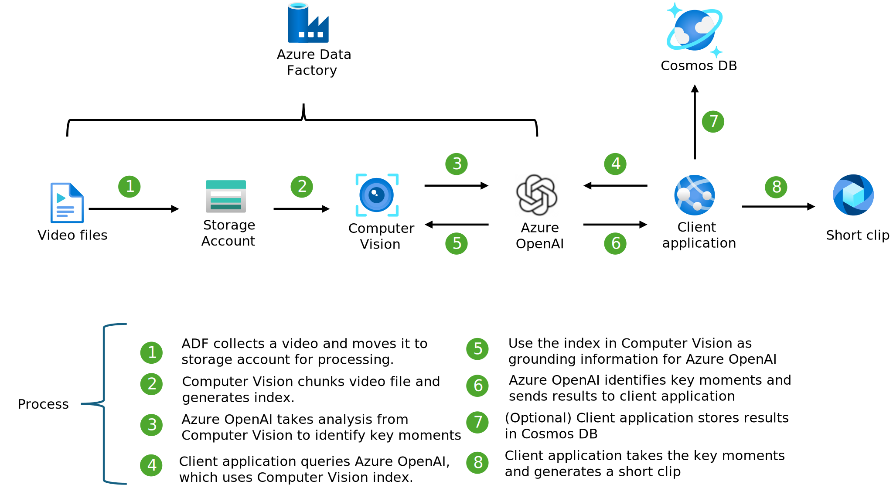

# Enterprise Azure OpenAI Hub

## Overview

Welcome to the Enterprise Azure OpenAI Hub!

This repository is your ultimate guide to the exciting world of Generative AI on the Azure platform. Whether you are a seasoned AI enthusiast or just starting your journey, this hub is designed to provide an easy, fun, rapid, and immersive learning experience, and ideally accelerate the path from whiteboard to proof of concept, and from proof of concept to production in an Enterprise context.
   
Our primary goal is to empower you to explore a multitude of use cases with relevant Azure services, fully configured to meet your security and compliance requirements for the Enterprises. We've carefully structured this repository to provide an intuitive understanding of how best to leverage the power of Azure services for your AI needs. Through a series of real-world examples, and playbooks you'll gain practical insights into using Azure to solve complex problems and develop cutting-edge AI solutions.  
   
But we don't stop at just exploring. The **Enterprise Azure OpenAI Hub** also serves as a comprehensive library of use cases based on proven patterns. We understand the importance of best practices in driving successful AI initiatives. Therefore, every use case in our library aligns with the highest industry standards and promotes best practices. You'll learn not just the 'how', but also the 'why' behind each pattern, giving you a solid grounding in the principles of secure and compliant AI development.  
   
Dive in and start exploring! The **Enterprise Azure OpenAI Hub** is your gateway to the world of AI on Azure. Whether you're a developer, a data scientist, or a business leader, you'll find everything you need to get started and build your AI skills. Let's create the future together!

## Table of Contents

- [Enterprise Azure OpenAI Hub reference implementation](#enterprise-azure-openai-hub-reference-implementation)
    - [Architecture and design](#letter-a)
    <!-- [Security and compliance](#letter-b)-->
- [Use cases](#use-cases)
- [Contributing](#contributing)
- [Roadmap](#roadmap)
---

### Enterprise Azure OpenAI Hub reference implementation
   
The Enterprise Azure OpenAI Hub is not just a learning resource; it's a comprehensive foundation for all your AI applications and use cases. It provides a robust infrastructure that allows you to build, test, and deploy AI models with ease. With our extensive library of use cases, you can dive right into practical applications of AI, learning by doing and gaining invaluable hands-on experience.

One of the key strengths of **Enterprise Azure OpenAI** Hub is its uncompromising focus on security, scalability, and reliability (if you decide to lead with our recommendations). We understand that these are non-negotiable requirements for any AI initiative. Therefore, we've embedded these principles right into the core of the **Enterprise Azure OpenAI Hub**. Our platform is designed to ensure that your AI applications are not only powerful and flexible, but also secure and reliable.   
  
Scalability is another critical aspect of AI development. As your skills grow and your needs evolve, the **Enterprise Azure OpenAI Hub** is ready to scale with you, supporting everything from simple proof-of-concept models to complex, enterprise-wide AI solutions.  
   
So why wait? Start your journey with Generative AI on Azure today. Dive into the **Enterprise Azure OpenAI Hub reference implementation**, and discover the incredible potential of AI. Let's create the future together!

You can deploy the following reference implementations to your Azure subscription.

| Reference Implementation | Description | Deploy | Instructions  
|:----------|:-------------------------|:------------|:-------|  
| Enterprise Azure OpenAI Hub | Provides an onramp path for Gen AI use cases while ensuring a secure-by-default Azure Open AI workload composition into your Azure regions and subscriptions |  | [User Guide](./docs/EnterpriseAzureOpenAIHub.md) |  

 [Architecture and design](./docs/architecture.md)

The architecture and design is proven, prescriptive, with security and governance being front and center - but not at the expense of autonomy and developer freedom for innovation and exploration. It does not leave any room for interpretation, as its been validated with our largest and most complex customers in highly regulated industries. Yet, it provides a flexible starting point for the less complex, and smaller customers, and can scale alongside the organization, business requirements, use cases, and the Azure platform itself due to the design principles and patterns that are employed alongside with the alignment with the overall Azure platform roadmap.

<!-- Commenting out for now
 [Security and compliance](./docs/security.md)

Customers in regulated industries must define and enforce required controls in order to meet compliance and security requirements while empowering application teams with sufficient freedom to innovate and deploy Azure AI services in a safe and secure manner. To ensure the right balance for the central platform and the application teams, Enterprise Azure OpenAI Hubprovides a secure and compliant foundation for AI workloads, while also providing a secure-by-default Azure OpenAI workload composition into the designated Azure subscriptions.
-->

### Use cases

The Enterprise Azure OpenAI Hub provides prescriptive architecture and design guidelines for several use cases that have served as proven patterns in several customer engagments. We aim to incorporate the learnings and best practices while making it as simple as possible for you to validate in your own context, using your own data as needed. Whether you are using the use cases for learning, exploration, or production deployments - we are equally happy as long as it can help you in your desired direction while unlocking Gen AI scenarios on the Azure platform. We will continue to iterate and add more use cases to the library as we continue to evolve and refine commun customer patterns and adoption, aligned with the development of the Azure AI platform itself.

For technical validation of the use cases you consider to deploy, you can go through the step-by-step guidance in the [use cases documentation](./docs/use-cases.md).

For a deeper understanding of the architecture for each use case, and the reasoning behind the design decisions, you can read more about the available use cases in the sections below.

#### Image and Video recognition

GPT4 Vision together with Azure AI Vision services can be used to recognize and understand the content of images and videos. This use case is designed to provide a comprehensive understanding of how to leverage the power of Azure AI Vision services to solve complex problems and develop cutting-edge AI solutions.

Learn more about the architecture and how to use the use case in the [Image and Video recognition architecture article](./docs/azure-vision-architecture.md).

#### 'On Your Data'

Azure native RAG Architecture leveraging Azure AI search for vectorization and using Azure OpenAI for generating embeddings and decoding the embeddings to generate text. This use case is designed to provide a comprehensive understanding of how to leverage the power of Azure AI services to solve complex problems and develop cutting-edge AI solutions on your own Enterprise data.
 

Learn more about the architecture and how to use the use case in the ['On Your Data' architecture article](./docs/rag.md)

To learn more about the general "Azure OpenAI - 'On Your Data'" product documentation, visit the offial [Azure OpenAI documentation](https://learn.microsoft.com/azure/ai-services/openai/concepts/use-your-data?tabs=ai-search). 

## Contributing

This project welcomes contributions and suggestions.  Most contributions require you to agree to a
Contributor License Agreement (CLA) declaring that you have the right to, and actually do, grant us
the rights to use your contribution. For details, visit https://cla.opensource.microsoft.com.

When you submit a pull request, a CLA bot will automatically determine whether you need to provide
a CLA and decorate the PR appropriately (e.g., status check, comment). Simply follow the instructions
provided by the bot. You will only need to do this once across all repos using our CLA.

This project has adopted the [Microsoft Open Source Code of Conduct](https://opensource.microsoft.com/codeofconduct/).
For more information see the [Code of Conduct FAQ](https://opensource.microsoft.com/codeofconduct/faq/) or
contact [opencode@microsoft.com](mailto:opencode@microsoft.com) with any additional questions or comments.

## Trademarks

This project may contain trademarks or logos for projects, products, or services. Authorized use of Microsoft 
trademarks or logos is subject to and must follow 
[Microsoft's Trademark & Brand Guidelines](https://www.microsoft.com/en-us/legal/intellectualproperty/trademarks/usage/general).
Use of Microsoft trademarks or logos in modified versions of this project must not cause confusion or imply Microsoft sponsorship.
Any use of third-party trademarks or logos are subject to those third-party's policies.

## Microsoft Sponsorship

The AI hub project was created by the **Microsoft Strategic Workload Acceleration Team (SWAT)** in partnership with several Microsoft engineering teams who continue to actively sponsor the sustained evolution of the project through the creation of additional reference implementations for common artificial intelligence and machine learning scenarios.
