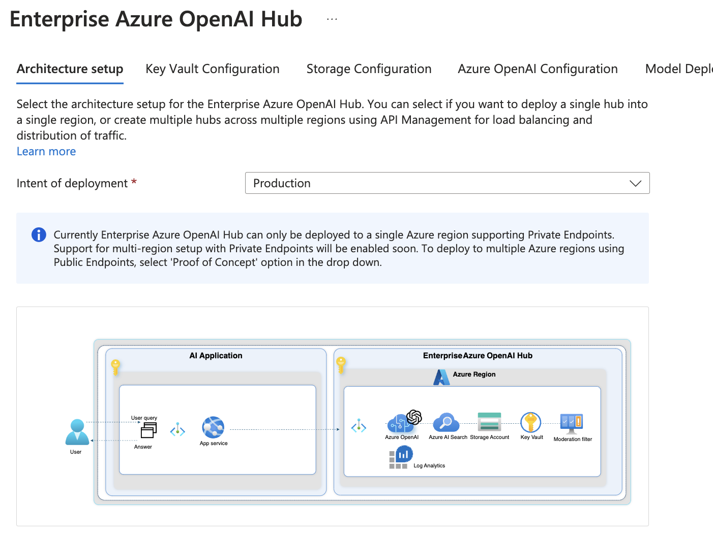
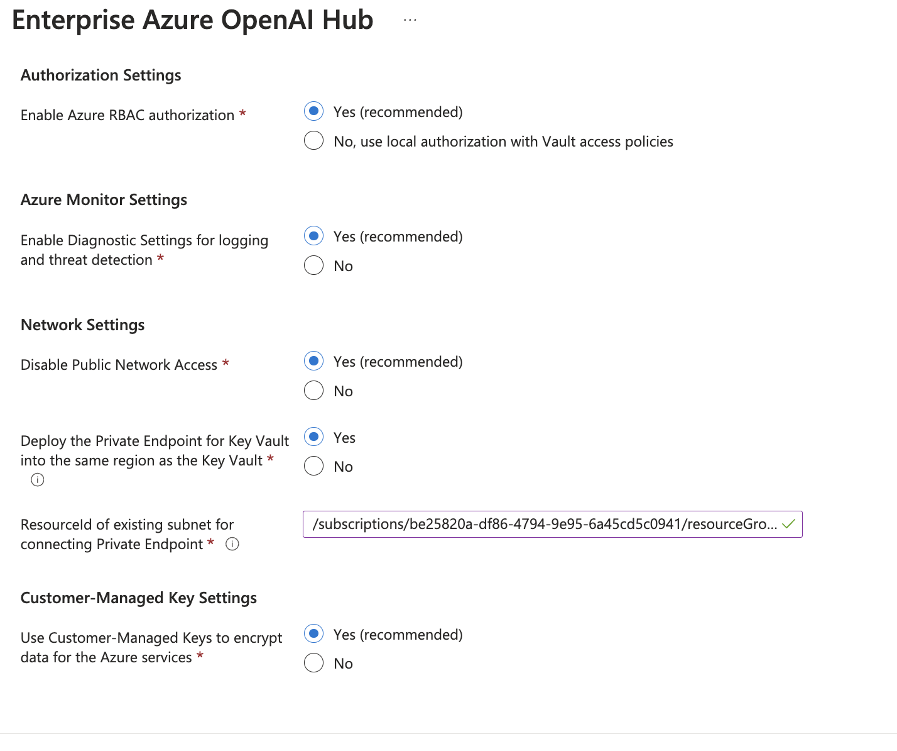
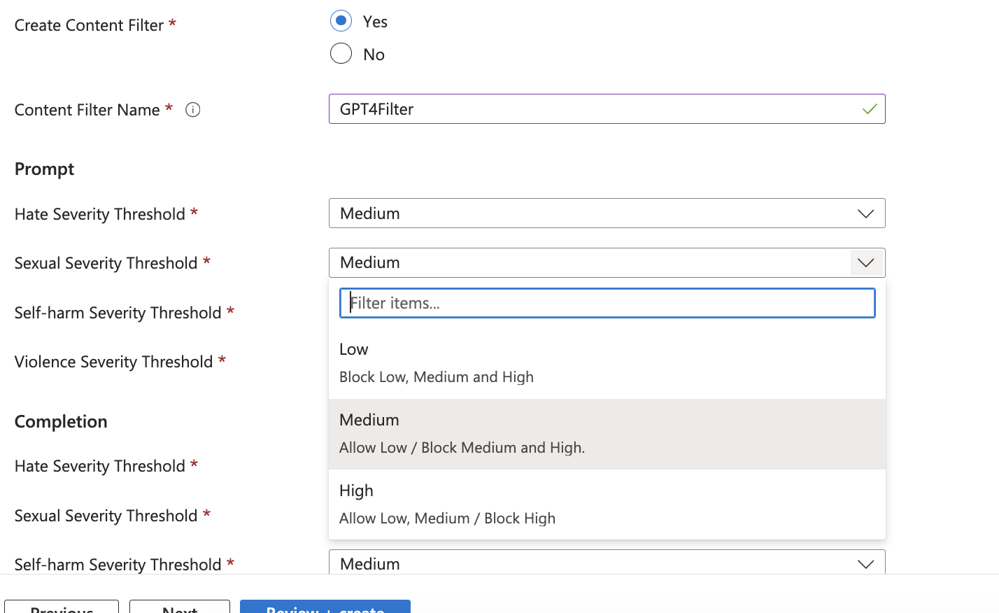
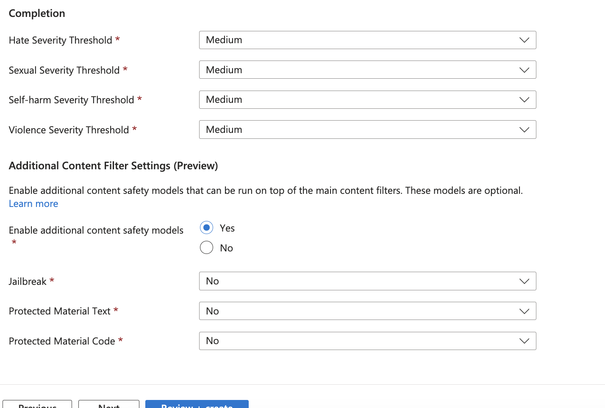

# Enterprise Azure OpenAI Hub - User Guide


This user guide explains the setup and deployment of secure and compliant Generative "AI hub on Azure".
The reference implementation has been developed, validated, and proven with several of Microsoft's largest customers, and represent the best practices for the Azure serivces involved regardless of industry industry, and to accelerate a safe and secure by-default deployment of Generative Azure Open AI on Microsoft Azure. We will continue to enhance and develop the reference implementation alongside with the overall Azure roadmap, based on proven and validated design patterns with our customers.

## Table of Contents

- [What is Enterprise Azure OpenAI Hub?](#what-is-enterprise-azure-openai-hub)
  - [Deploy for Production](#deploy-for-production)
  - [Deploy for PoC and testing purposes](#deploy-for-poc-and-testing-purposes)
  - [Architecture and scale-out considerations](#architecture-and-scale-out-considerations)
- [Deployment instructions](#deployment-instructions)
  - [Pre-requisites](#pre-requisites)
  - [Step-by-step deployment guidance](#step-by-step-deployment-guidance)
- [Getting started post deployment](#getting-started-post-deployment)
  - [Azure native RAG on your own data](#azure-native-rag-on-your-own-data)
    - [PowerShell script for RAG enablement](#powershell-script-for-rag-enablement)
      - [Ingestion job using Azure Open AI, AI Search, and Storage Account](#ingestion-job-using-azure-open-ai-ai-search-and-storage-account)
      - [Content generation using Azure Open AI API endpoint](#content-generation-using-azure-open-ai-api-endpoint)

---

| Reference Implementation | Description | Deploy | Instructions  
|:----------|:-------------------------|:------------|:-------|  
| Enterprise Azure OpenAI Hub | Provides an onramp path for Gen AI use cases while ensuring a secure-by-default Azure Open AI workload composition into your Azure regions and subscriptions |  | [User Guide](./EnterpriseAzureOpenAIHub.md) |  

## What is Enterprise Azure OpenAI Hub?

Enterprise Azure OpenAI Hub provides powerful, generative AI capabilities that organizations can access securely over a private network, use their own customer-managed keys to encrypt the data, and enable sophisitcated monitoring and observability of their AI workloads, while managing authentication and authorization centrally. This reference implementation provides a secure and compliant deployment of Enterprise Azure OpenAI Hub, and the recommended configuration is aligned with Enterprise security and compliance requirements.

Further, it allows organizations to deploy the Azure Open AI instance(s) to the regions of their choice, and where capacity exists for the respective model deployments, while honoring the connectivity and networking requirements of the organization.

The Enterprise Azure OpenAI Hub includes the following Azure services:

* Azure OpenAI
* Private Endpoints
* Network Security Groups
  * Application Security Groups
* Storage Account for 'On Your Data' scenarios, such as RAG with documents, videos, and images.
* Key Vault for customer-managed keys
* Azure Monitor
  * Log Analytics
  * Diagnostics settings enabled for Azure services for Logs and Metrics
* Managed Identity
  * Identities created for each Azure service with respective Role Assignment for Service 2 Service authorizations

Optionally, you can also get started with the initial Gen AI use case (e.g., Azure native RAG architecture and setup for Image and Video recognition) to accelerate the adoption of Generative AI in your organization.

* Model deployments, such as:
  * GPT-3
  * GPT-4
  * GPT-35-turbo
  * GPT-35-turbo-16k
  * GPT-4-32k
  * GPT-4 with Vision
  * Embeddings
* Azure AI Search
* Azure AI Document Intelligence
* Azure AI Vision
* Azure Data Factory
* Azure CosmosDB
* Azure API Management for scale-out and multi-region deployments

## Deploy for Production

When deploying Enterprise Azure OpenAI Hub via Azure portal, the default deployment intent is set to "Production", and the deployment experience is tailored to the Enterprises to conform to their security and compliance requirements. All recommendations are by default being enabled, but allows you to customize each option as needed, should there be any specific requirements that need to be catered for (e.g., use Microsoft-managed keys instead of customer-managed keys for one or more services).

By selecting "Production", you can currently deploy to only a single Azure region in a subscription, where a virtual network must be already created with a dedicated subnet to be used for the Private Endpoints for each service if you require private connectivity for the Azure services.

For multi-region deployment, select "Proof of Concept" as the deployment intent, and follow the instructions in the next section.

>Note: In case you have your existing Express Route connectivity configured for a particular Azure region, where your Virtual Network is created, but Azure OpenAI model availabily may be in a different region, you can deploy the Private Endpoint for the Azure services to be located in a different Azure region than where you are deploying the Enterprise Azure OpenAI Hub. This is to ensure that the Azure Open AI instance is deployed in the region where the model is available, and the Private Endpoint is deployed in the region where your Virtual Network is located.

## Deploy for PoC and testing purposes

When deploying Enterprise Azure OpenAI Hub via Azure portal, the deployment intent can be set to "Proof of Concept", you can optionally explore additional features and capabilities, such as:

* Deploy to multiple Azure regions, where Azure API Management is introduced to facilitate the load balancing, and also provides the retry logic and error handling in case of a failure or unavailability of the Azure Open AI instance in one of the regions. This option requires the Azure services to use Public Endpoints as the APIM service is not available over Private Endpoints in the V2 version currently.
* Explore sample applications, such as [Sample Chat App with AOAI](https://github.com/microsoft/sample-app-aoai-chatGPT/tree/main) to quickly have a web application that can interact with the Azure Open AI instance, and start generating content based on the data that you have ingested in an Azure native RAG architecture.
* Any other features and capabilities that are not available in the "Production" deployment intent, such as Preview features and use-cases where not all Enterprise security requirements can be conformed to.

## Deployment instructions

This section will describe how to deploy the "Enterprise Azure OpenAI Hub" reference implementation into an Azure subscription.

### Pre-requisites

The "Enterprise Azure OpenAI Hub" reference implementation is deployed at the *subscription* scope in Azure, and requires a few pre-requisites to be in place before you can deploy the reference implementation:

- Ideally use a dedicated Azure subscription, where you have submitted the subscription ID into the form for [requesting access to Azure OpenAI](https://customervoice.microsoft.com/Pages/ResponsePage.aspx?id=v4j5cvGGr0GRqy180BHbR7en2Ais5pxKtso_Pz4b1_xUOFA5Qk1UWDRBMjg0WFhPMkIzTzhKQ1dWNyQlQCN0PWcu). This will ensure that the subscription is enabled for Azure OpenAI, including GTP-4.
- The user who's deploying the reference implementation must be *Owner* of the subscription where the reference implementation will be deployed, as the deployment will be making role assignments for the managed identities that are created for the Azure services.
- For the "Production" deployment intent, you must have a Virtual Network created in the Azure region where you want to deploy the reference implementation, and a dedicated subnet for the Private Endpoints for the Azure services that you want to deploy with Private Endpoints. The Virtual Network does not require to be in the same region where you are deploying the reference implementation, as the Private Endpoints can be in a different region compared to the Azure services that are created. For the "Proof of Concept" deployment intent, you can deploy to multiple Azure regions, and the Virtual Network and subnet requirements are not needed.

## Step by step deployment guidance

This section will explain the deployment experience and the options provided for the "Enterprise Azure OpenAI Hub" reference implementation.

Once the pre-requisites have been completed, you can deploy the reference implementation using this link [*Deploy to Microsoft Cloud*](https://aka.ms/DeploySecureGenAI), it will start the deployment experience in the Azure portal into your default Azure tenant. In case you have access to multiple tenants, ensure you are selecting the right one.

### 1 - Architecture Setup

The first tab will allow you to specify the intent of the deployment, and the overall architecture setup. You can select the deployment intent as "Production" or "Proof of Concept", and subject to the selection, the deployment experience will be tailored to the respective intent.

The region you select when deploying to "Production" will be used for the deployment and the Azure services that will be created. If you want to deploy using Private Endpoints for the Azure services, select the region where you know there's capacity and availability for Azure OpenAI, even if that is a region different then where your Virtual Network is created, as we enable you to select the region for this for each service later.
Provide a prefix for the naming convention that will be used for the resources.

> Note: the naming convention will primarily consist of 'prefix'-'region'-'resourcetype' where possible.



When selecting "Production" as the intent, provide the prefix for the naming convention and select the target Azure region.


When selecting "Proof of Concept" as the intent for the deployment, you can optionally select to deploy to a single region, or to multiple regions. When deploying to multiple regions, Azure API Management will be used to facilitate the load balancing, and also provides the retry logic and error handling in case of a failure or unavailability of the Azure Open AI instance in one of the regions. This option requires the Azure services to use Public Endpoints as the APIM service is not available over Private Endpoints in the V2 version currently.


When selecting this option, you must provide region input for the initial deployment, the secondary deployment, and also select one of the available regions for Azure API Management V2 service.


### 2 - Key Vault Configuration

Configure the Key Vault that will be used to store the keys used by the storage account for encryption at rest, as well as the Azure Open AI service. It is recommended to leave with the default recommendations as it relates to the security and compliance recommendations. If needed, you can opt out of the recommendations, assuming you are aware of the implications.




### 3 - Storage Configuration

This page will create and configure the storage account that will be used in conjunction with the Key Vault and the Azure Open AI service. This enables you to bring your own data that you can use to fine-tune and train the Azure Open AI service for enterprise-specific contexts, fully encrypted at rest using a customer-managed key.

Provide a key name, and the resourceId for an existing subnet when deploying with Private Endpoint. Same as with the Key Vault configuration, if you are deploying to a different region vs where the virtual network is created, select a different region for the private endpoint.


### 4 - Azure OpenAI Configuration

Configure the Azure OpenAI instance that will be created, by providing a name for the customer-managed key, and the resourceId to the subnet where the Private Endpoint will be deployed. Same as with the Key Vault and Storage Account configuration, if you are deploying to a different region vs where the virtual network is created, select a different region for the private endpoint.


### 5 - Model Deployment and Content Filtering

On this page, you can optionally select to deploy an available model to your Azure OpenAI instance, subject to the available models in the region you have selected. Should there be any capacity constraints with the selected model, the validation API will catch that and inform you before you can submit the deployment.


Select the intial model deployment from the drop down list, and provide a name for the deployment.


Additionally, you can configure content filtering and advanced filtering settings, that are running on top of the general filtering settings. This is to ensure that the generated content is compliant with the organization's policies and guidelines.





### 5 - Use Cases and Additional Services

On this page, you can optionally select your initial use case, and additional services that you may want to deploy alongside the Azure OpenAI instance. The list of services will dynamically appear based on the use case you have selected. Each Azure service will provide similar configuration options as the previous pages, and you can configure them as needed in order to meet your security and compliance needs for the overall architecture and setup.

To learn more about the use cases and additional services that are available for the "Enterprise Azure OpenAI Hub" reference implementation, see the [use cases](./use-cases.md) documentation.


In the drop down, you can currently select between the following use cases:

* Image and Video Recognition
* 'On Your Data'

Both use cases will provide you with required details for the services that must be configured to enable the use case, and you can configure them as needed in order to meet your security and compliance needs for the overall architecture and setup.

** Image and Video Recognition **

When selecting the Image and Video Recognition use case, you can configure the Azure AI Vision, Azure AI Search, and Azure AI Document Intelligence services, Azure Data Factory, and Azure CosmosDB services, and provide the necessary details for the configuration.


** 'On Your Data' **

When selecting the 'On Your Data' use case, you can configure the Azure AI Search, Azure Document Intelligence, Azure Data Factory, and Azure CosmosDB services, and provide the necessary details for the configuration.


When selecting 'On Your Data' as the use case, you have an option to use a dedicated Azure OpenAI instance for the purpose of orchestrating indexing and content generation based on the data that you have ingested in the storage account, and indexed in Azure AI Search, and generate the embeddings. You can deploy this to a remote subscription (recommended to not compete about quota with the main Azure OpenAI instance), and provide the necessary details for the configuration.


** 'Proof of Concept' and 'On Your Data' use case **

If you selected the intent of the deployment to be "Proof of Concept", you can optionally deploy a sample Web Application into its own resoucre group, that will be configured to interact with Azure OpenAI instance, and start generating content based on the data that you have ingested in an Azure native RAG architecture.

For this to work, it requires an Application Registration in Entra ID. You can choose to use an existing one, or create a new one, where you provide the secret value (as secure string) to the UX, and the Application ID will be used to configure the Web Application.

>Note: You can also create the App registration later if you don't have the required permission in your Entra ID. Follow the instructions in the [Getting started post deployment](#getting-started-post-deployment) section to create the App registration and configure the Web Application.


When creating a new App Registration, this can be done directly in the deployment UX. Select New, and provide the necessary details for the App Registration, and the secret value.


### Review + create

*Review + Create* page will validate your permission and configuration before you can click deploy. Once it has been validated successfully, you can click *Create*

## Getting started post deployment

Subject to the deployment options you have selected, you may need to do additional configuration in your environment, such as Private DNS Zones creation and conditional forwarding if used over private endpoints, as well as additional RBAC assignment for users/groups/SPNs to interact with the services.

## Azure native RAG on your own data

If you are interested in getting started with the initial Gen AI use case (e.g., Azure native RAG architecture and setup) to accelerate the adoption of Generative AI in your organization, the following instructions and script examples can be used to:

1. Upload files, such as text, images, and videos, to the storage account that you have created as part of the deployment, subject to the configuration you have selected (e.g., the setup highly recommends using Azure RBAC, disabling SAS tokens, and using customer-managed keys for encryption at rest, but if you have selected anything differently, you need to cater for that while getting the data into your storage account).

2. Use the Azure Open AI ingestion API to create one or more indexes in Azure AI Search, to start indexing the data that you have uploaded to the storage account, and make it available for the Azure Open AI instance to enable typical RAG use cases.

3. Use the Azure Open AI API to interact with the Azure Open AI instance, and start generating content based on the data that you have uploaded to the storage account, and indexed in Azure AI Search.

### PowerShell script for RAG enablement

The following PowerShell scripts can be used to 1) start an ingestion job on Azure Open AI to ingest the data from the storage account into Azure AI Search, and 2) access the Azure Open AI API to start generating content based on the data that you have ingested.

#### Ingestion job using Azure Open AI, AI Search, and Storage Account

Modify this script to provide the necessary values for the Azure Open AI endpoint, the embedding deployment name, the ingestion job name, the storage account endpoint, the storage container name, the storage resource ID, and the Azure AI Search endpoint.

```powershell

# Ingestion job using Azure Open AI, AI Search, and Storage Account. The following snippet assumes Managed Identity is properly configured and has the necessary permissions to access the resources, and that the user has Open AI contributor role on the Azure Open AI resource.

# Azure Open AI configuration

$AzureOpenAIEndpoint = ""
$EmbeddingDeploymentName = ""
$IngestionJobName = ""

# Storage Configuration

$StorageAccountEndpoint = ""
$StorageContainerName = ""
$StorageResourceId = ""

# Azure AI search configuraton

$AzureAiSearchEndpoint = ""

# Get Token

$TokenRequest = Get-AzAccessToken -ResourceUrl "https://cognitiveservices.azure.com"
$MyToken = $TokenRequest.token

# Set Body (body must be present but empty for the request)
$Body = @'  
{  
}  
'@  

# AI Ingestion Request
$AzureOAIRequest = @{
    Uri = "https://$($AzureOpenAIEndpoint)/openai/extensions/on-your-data/ingestion-jobs/$($IngestionJobName)?api-version=2023-10-01-preview"
    Headers = @{
        Authorization = "Bearer $($MyToken)"
        'Content-Type' = 'application/json'
        'storageEndpoint' = "https://$($StorageAccountEndpoint)"
        'storageConnectionString' = "ResourceId=$($StorageResourceId)"
        'storageContainer' = $StorageContainerName
        'searchServiceEndpoint' = "https://$($AzureAiSearchEndpoint)"
        'embeddingDeploymentName' = $EmbeddingDeploymentName
        }
    Body = $Body
    Method = 'PUT'
    }
    
$Response = Invoke-WebRequest @AzureOAIRequest
[Newtonsoft.Json.Linq.JObject]::Parse($Response.Content).ToString()

# Get Status on the ingestion job

$GetStatusRequest = @{
    Uri = "https://$($AzureOpenAIEndpoint)/openai/extensions/on-your-data/ingestion-jobs/$($IngestionJob)?api-version=2023-10-01-preview"
    Headers = @{
        Authorization = "Bearer $($MyToken)"
        }
    Method = 'GET'
}
$GetResponse = Invoke-WebRequest @GetStatusRequest
[Newtonsoft.Json.Linq.JObject]::Parse($GetResponse.Content).ToString()

```

#### Content generation using Azure Open AI API endpoint

Modify this script to provide the necessary values for the Azure Open AI endpoint, the embedding deployment name, and the model name.

```powershell

#T he following snippet assumes Managed Identity is properly configured and has the necessary permissions to access the resources, and that the user has Open AI reader role on the Azure Open AI resource.

# Azure Open AI configuration

$AzureOpenAIEndpoint = ""
$DeploymentName = ""
$EmbeddingDeploymentName = ""
$Prompt = ""

# Azure AI search configuraton

$AzureAiSearchEndpoint = ""
$IndexName = "" 

# Get Token
$TokenRequest = Get-AzAccessToken -ResourceUrl "https://cognitiveservices.azure.com"
$MyToken = $TokenRequest.token

# Form the request body towards the Azure Open AI API endpoint, with AzureCognitiveSearch added as dataSource for RAG
$Body = @"
{
"dataSources": [
    {
        "type": "AzureCognitiveSearch",
        "parameters": {
            "endpoint": "https://$($AzureAiSearchEndpoint)",
            "indexName": "$($IndexName)",
            "embeddingDeploymentName": "$($EmbeddingDeploymentName)"
        }
    }
],
"messages": [
    {
        "role": "system",
        "content": "You are an AI assistant that helps people find information."
    },
    {
        "role": "user",
        "content": "$($Prompt)"
    }
]
}
"@

# AI Request
$AzureOAIRequest = @{
    Uri = "https://$($AzureOpenAIEndpoint)/openai/deployments/$($DeploymentName)/extensions/chat/completions?api-version=2023-10-01-preview"
    Headers = @{
        Authorization = "Bearer $($MyToken)"
        'Content-Type' = 'application/json'
        }
    Method = 'POST'
    Body = $Body
    #UseBasicParsing = $true
    }
$Response = Invoke-WebRequest @AzureOAIRequest
[Newtonsoft.Json.Linq.JObject]::Parse($Response.Content).ToString()

```

## Next Steps

Learn more about the [use cases](./use-cases.md) that are available for the "Enterprise Azure OpenAI Hub" reference implementation.