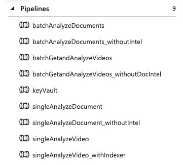
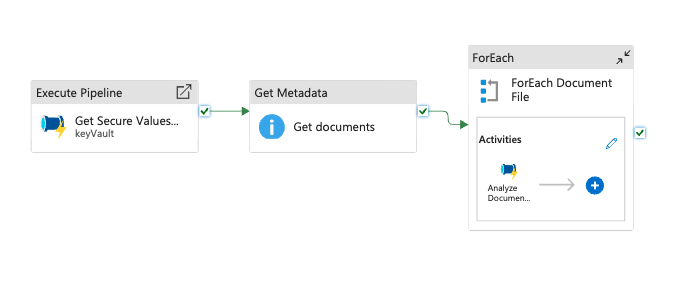
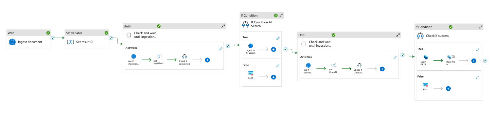
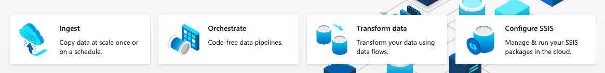

# Azure Data Factory Pipelines: Batch and Event-Based Modes  

In our recent project, we've built several Azure Data Factory pipelines. Each pipeline can be run in either batch mode or event-based mode.  

## Batch Mode vs Event-Based Mode  

In **batch mode**, the pipelines loop through all the files available in a designated folder. On the other hand, in **event-based mode**, each pipeline is set with a trigger that waits for a blob write event. This means that when you upload a file to a specific blob account, it triggers the event and the pipeline starts.  

## Types of Pipelines  

The pipelines available are designed to analyze documents and videos using different tools and services. These include:  

- Analyzing documents using Vision  
- Analyzing documents using Document Intelligence  
- Analyzing Videos using Vision  
- Analyzing videos using Video Indexer  

Each pipeline involves different steps based on the services used in analyzing the data. They also have a set of parameters which allow flexibility and can be configured specifically for each use case.  

## Working of Batch Pipelines  

The batch pipelines are quite similar in their functioning. The first activity after starting a batch pipeline is to retrieve the required keys from KeyVault, as some of the APIs used in the pipelines require API keys. We recommend using System assigned managed identity where possible. The second activity is to list all blobs in the assigned container (all videos or documents). For each blob in the list, the data factory activity will loop and run the relevant pipeline to analyze the content.
  
## Analyzing Documents Using Document Intelligence  

One of the pipelines starts by ingesting the selected document using the Document Intelligence REST API. The body of the POST contains the URL source referencing the document being analyzed. This ingestion process responds with an ID, which is then used as a reference to the ongoing analyzation process performed by Document Intelligence.
  
After the process is completed, the pipeline exports the information produced by Document Intelligence. This data is then ingested into AI Search using the on-your-data feature in Azure OpenAI API.
  
The primary use-case for this pipeline is to make data available to an AI application implementing the RAG pattern. Once the data is available in AI Search, the AI application can query Azure OpenAI using on-your-data with the created index in AI Search.
  
In addition to the primary objective, this pipeline also accomplishes a couple of secondary objectives - archiving files after indexing and storing metadata for other analytical purposes.
  
We also provide a separate pipeline that bypasses Document Intelligence and uses only OpenAI GPT-4 Vision to analyze the content of the documents.

## What is Azure Data Factory?  

Azure Data Factory (ADF) is a cloud-based data integration service provided by Microsoft Azure. It allows you to create data-driven workflows for orchestrating and automating data movement and data transformation.
  
ADF provides a platform to ingest, prepare, transform, and analyze your data, enabling you to turn raw data into valuable business insights. It's a serverless service, meaning you don't have to worry about infrastructure management and can focus on designing your workflows.  

ADF supports a wide range of data stores, including Azure-based data sources like Azure SQL Database, Azure Cosmos DB, and Azure Blob Storage, as well as many third-party data sources. It helps you to manage, transform and integrate big data from various sources.  

Whether you're migrating data to the cloud, transforming big data into actionable insights, or automating data processing tasks, Azure Data Factory offers a robust and versatile solution.  

Using Azure Data Factory, you can:  

- **Create and schedule data-driven workflows** (called pipelines) to move and transform data.  
- **Lift and shift existing SSIS packages** to Azure and run them with full compatibility.  
- **Ingest and prepare data** from various sources, transform it, and load it into data stores of your choice.  
- **Monitor your pipelines** with a rich visual interface for managing, monitoring, and troubleshooting.  

In the context of our pipelines, Azure Data Factory plays a crucial role in ingesting, processing, and transforming data from various sources, making it a powerful tool in our data analysis workflows.

## What is Azure Document Intelligence?  

Azure Document Intelligence is a suite of artificial intelligence (AI) services provided by Microsoft Azure that uses machine learning and AI to understand and analyze unstructured data typically found in business documents.
  
This suite of services can extract, identify, and categorize relevant information from a wide range of document types including invoices, receipts, contracts, reports, and more. It can understand various formats and layouts, and can process both digital-born and scanned documents.  

The main goal of Azure Document Intelligence is to extract insights from documents and make them searchable, indexable, and analyzable, thus turning unstructured data into structured information that can be used in various business scenarios.  

Azure Document Intelligence includes several services such as:  

- **Form Recognizer**: A service that uses machine learning technology to identify and extract key-value pairs and tables from documents.  

- **Document Conversion**: A service that converts various document formats into a unified format that's ready for processing.  

- **Named Entity Recognition (NER)**: A service that identifies and categorizes entities in your text as predefined categories such as names of people, organizations, locations, expressions of times, quantities, monetary values, percentages, and more.  

In the context of our pipelines, Azure Document Intelligence plays a critical role in ingesting and analyzing the documents, and extracting valuable information from them.
