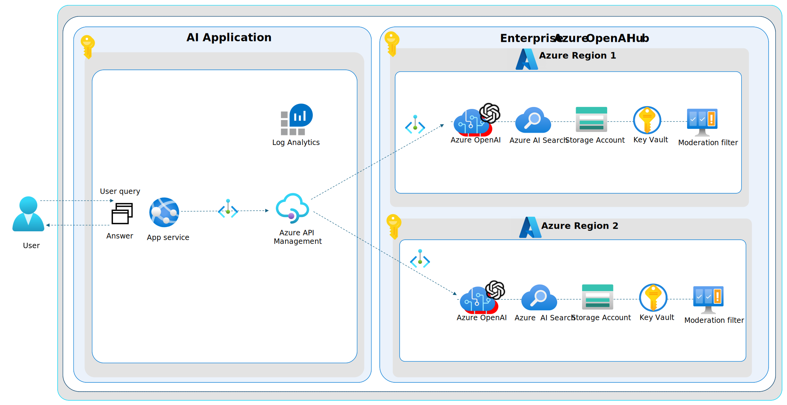
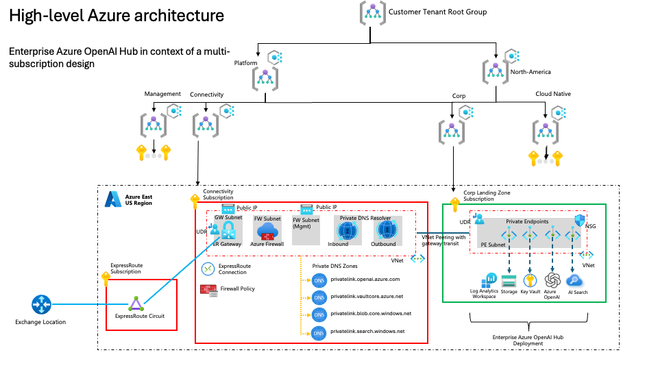

# Architecture and design for the Enterprise Azure OpenAI Hub

The Enterprise Azure OpenAI Hub is an advanced, scalable platform designed to harness the power of AI while ensuring strict compliance with enterprise security standards. The architecture is built on the robust foundations of Azure, leveraging its cloud capabilities to create a flexible and modular solution that can adapt to a wide array of use cases. By integrating Azure OpenAI's cutting-edge AI models, the Hub provides enterprises with a seamless, interoperable service that emphasizes security, scalability, and alignment with both Azure best practices and the Azure OpenAI product roadmap.

## Table of Contents

- [Overview](#overview)
  - [Scalability](#scalability)
  - [Service Interoperability](#service-interoperability)
  - [Secure by-default](#secure-by-default)
  - [Azure roadmap alignment](#azure-roadmap-alignment)
- [Design areas](#design-areas)
  - [Scalability and reliability](#scalability-and-reliability)
  - [Compute and orchestration](#compute-and-orchestration)
  - [Network and connectivity](#network-and-connectivity)
  - [Security, Governance, and Compliance](#security-governance-and-compliance)
  - [Identity and Access Management](#identity-and-access-management)
  - [Data Protection](#data-protection)
  - [Logging and Threat Detection](#logging-and-threat-detection)
- [Next steps](#next-steps)
---

## Overview

The Enterprise Azure OpenAI Hub is designed to provide a secure, scalable, and reliable platform for AI workloads. It is built on the principles of secure by-default, scalability, and alignment with the Azure roadmap. The architecture is designed to ensure that the AI workloads are not only powerful and flexible, but also secure and reliable.

### Scalability

At the heart of the Enterprise Azure OpenAI Hub is a commitment to scalability. Designed to support enterprises of all sizes, the architecture is built on Azure's scalable compute resources, ensuring that the Hub can handle varying loads with ease. Auto-scaling capabilities are baked in, allowing the system to dynamically adjust to the demand by spinning up or down resources in real-time. This ensures optimal performance and cost-efficiency in a multi-region setup from the get go, or by adding additional regions as the need arises.

### Service Interoperability

Recognizing the diverse needs of enterprise users, the Enterprise Azure OpenAI Hub is architected for high interoperability and modularity. Services are interacting using Managed Identity (subject to your choice of service AuthN/AuthZ), facilitating seamless integration and deployment where credential management is not needed, where services have 'just enough access' using fine-grained Role-Based Access Control for both the control-plane and data-plane. This modular approach allows for the creation of tailored solutions that can be easily assembled to address specific use cases. Our API-first design ensures that various components of the Enterprise Azure OpenAI Hub can communicate effortlessly with existing enterprise systems and Azure services.

### Secure by-default

Security is not an afterthought; it is woven into the fabric of the Enterprise Azure OpenAI Hub's architecture. The platform adopts a "secure by default" posture, implementing Azure's comprehensive security controls and best practices. This includes network security groups, role-based access control (RBAC), restricted inbound and outbound connections, encryption at rest and in transit, logging and threat detection, and Azure Entra ID for centralized identity management.

### Azure roadmap alignment

The design of the Enterprise Azure OpenAI Hub is in strict alignment with Azure's best practices. It utilizes well-architected frameworks for reliability, operational excellence, performance efficiency, and cost optimization. Continuous integration and continuous deployment (CI/CD) pipelines are implemented using Azure DevOps, where we are actively working to ensure that updates and new features are rolled out reliably to keep the accelerator in sync with the Azure OpenAI product roadmap, to stay at the forefront of AI innovation.

## Design areas

The architecture of the Enterprise Azure OpenAI Hub is divided into several key areas, each of which is designed to address specific aspects of the platform's functionality and security.

The following sections provide an overview of the design considerations and the design recommendations for each area, so you can understand how the Enterprise Azure OpenAI Hub is designed to meet the needs of your enterprise, while also making informed decisions in case you need to customize the architecture to meet your specific requirements.

### Scalability and reliability

The diagram above shows an example where the Enterprise Azure OpenAI Hub is being deployed to a compliant, corp connected landing zone, where all services are connected via private endpoint to the virtual network. The virtual network is connected to the hub virtual network via VNet peering, and the hub virtual network is connected to on-premises network via ExpressRoute.

In the most simplistic form, users - assuming Azure RBAC has been granted to the Open AI instance, and model deployment has completed, can interact with the Azure Open AI API over the private endpoint, and the Azure Open AI instance will respond with the generated text. If any data must be provided, the storage account is encrypted using customer-managed keys, and the keys are stored in a Key Vault. The Key Vault is also used to store the customer-managed keys for the Azure Open AI instance, and other Azure services that require encryption keys with customer-managed keys.

### Design considerations

* To scale out the Azure Open AI instance, there's a few things to consider:

    * The limit of Azure Open AI resources per region per Azure subscription is 30
    * The regional quota (soft) limits (token per minutes) per Azure subscription for GPT-35-Turbo and GPT-4 are as follows: 
    * GPT-35-turbo: 
        * eastus, southcentralus, westeurope, francecentral, uksouth: 240k
        * northcentralus, australiaeast, eastus2, canadaeast, japaneast, swedencentral, switzerlandnorth: 300k
    * GPT-35-turbo-16k:
        * eastus, southcentralus, westeurope, francecentral, uksouth: 240k
        * northcentralus, australiaeast, eastus2, canadaeast, japaneast, swedencentral, switzerlandnorth: 300k
    * GPT-4:
        * eastus, southcentralus, westeurope, francecentral: 20k
        * northcentralus, australiaeast, eastus2, canadaeast, japaneast, uksouth, swedencentral, switzerlandnorth: 40k
    * GPT-4-32k:
        * eastus, southcentralus, westeurope, francecentral: 40k
        * northcentralus, australiaeast, eastus2, canadaeast, japaneast, uksouth, swedencentral, switzerlandnorth: 80k

* A single Azure Open AI instance may be suitable for a small PoC by independent application teams. 
* If a model in an Azure Open AI instance is shared by multiple teams, it is a "first come - first served" behavior, and the application must cater for retry logic and error handling.
* Quota is shared between all instances and models in the same region and subscription.

### Design recommendations

* If a model in an Azure Open AI instance is shared by multiple teams, and the model is being used by multiple applications, it is recommended to deploy a dedicated Azure Open AI instance per application, and load balance the requests across the instances. This will provide separation at instance level, and the application layer is responsible for load balancing, retry logic, and error handling if needed.
* To scale out Azure Open AI with multiple instances, it is recommended to deploy the instances across dedicated subscriptions, across dedicated regions. The quota is per region per subscription, and the regional quota is soft limit, and can be increased by contacting Microsoft support.
* Use centralized RBAC (Azure AD) and disable API key access to Azure Open AI, to avoid the need to manage API keys per application, and to ensure that the access to the Azure Open AI instance is centrally managed and controlled.
* Use customer-managed keys to encrypt the data, and store the keys in a Key Vault. This will ensure that the data is encrypted at rest, and the keys are stored in a secure location, and can be rotated as needed.
* Use centralized RBAC (Azure AD) for the Key Vault to ensure that the access to the Key Vault is centrally managed and controlled.
* Empower the application to use dedicated, application-centric Log Analytics Workspace(s) for the Azure Open AI instance(s) and requisite components such as Key Vault, Storage Accounts, NSGs etc., to ensure that the logs are stored in a secure location, and can be accessed by the application team as needed, and where they can build out their own observability using dashboards, workbooks, and alerts.
* Use Azure Policy to ensure that the Azure Open AI instance(s) are deployed with the right configuration, and that the configuration is maintained over time. For example, it is recommended to deploy Azure Open AI using a private endpoint, and not expose the service over the public internet.

### Network and connectivity

### Security, Governance, and Compliance

### Identity and Access Management

### Data Protection

### Logging and Threat Detection

### Conclusion

## Next Steps

Learn more about the [use cases](./use-cases.md) that are available for the **Enterprise Azure OpenAI Hub** reference implementation.