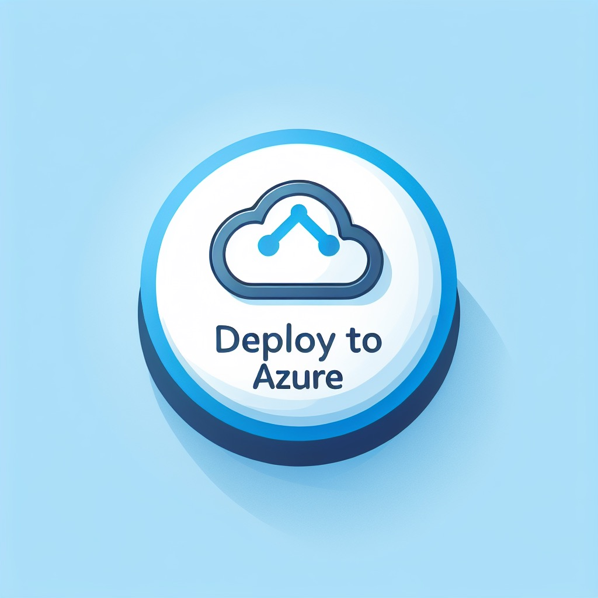

# Enterprise Azure OpenAI Hub - User Guide


This user guide explains the setup and deployment of secure and compliant Generative "AI hub on Azure".
The reference implementation has been developed, validated, and proven with several of Microsoft's largest customers, and represent the best practices for the Azure serivces involved regardless of industry industry, and to accelerate a safe and secure by-default deployment of Generative Azure Open AI on Microsoft Azure. We will continue to enhance and develop the reference implementation alongside with the overall Azure roadmap, based on proven and validated design patterns with our customers.

## Table of Contents

- [What is Enterprise Azure OpenAI Hub?](#what-is-enterprise-azure-openai-hub)
  - [Deploy for PoC and testing purposes](#deploy-for-poc-and-testing-purposes)
  - [Architecture and scale-out considerations](#architecture-and-scale-out-considerations)
- [Deployment instructions](#deployment-instructions)
  - [Pre-requisites](#pre-requisites)
  - [Step-by-step deployment guidance](#step-by-step-deployment-guidance)
- [Getting started post deployment](#getting-started-post-deployment)
  - [Azure native RAG on your own data](#azure-native-rag-on-your-own-data)
    - [PowerShell script for RAG enablement](#powershell-script-for-rag-enablement)
      - [Ingestion job using Azure Open AI, AI Search, and Storage Account](#ingestion-job-using-azure-open-ai-ai-search-and-storage-account)
      - [Content generation using Azure Open AI API endpoint](#content-generation-using-azure-open-ai-api-endpoint)

---

| Reference Implementation | Description | Deploy | Instructions  
|:----------|:-------------------------|:------------|:-------|  
| Enterprise Azure OpenAI Hub | Provides an onramp path for Gen AI use cases while ensuring a secure-by-default Azure Open AI workload composition into your Azure regions and subscriptions |  | [User Guide](./docs/fsiAOAI.md) |  

## What is Enterprise Azure OpenAI Hub?

Azure Open AI provides powerful, generative AI capabilities that organizations can access securely over a private network, use their own customer-managed keys to encrypt the data, and enable sophisitcated monitoring and observability of their AI workloads, while managing authentication and authorization centrally. This reference implementation provides a secure and compliant deployment of Enterprise Azure OpenAI Hub, and the recommended configuration is aligned with Enterprise security and compliance requirements.

Further, it allows organizations to deploy the Azure Open AI instance(s) to the regions of their choice, and where capacity exists for the respective model deployments, while honoring the connectivity and networking requirements of the organization.

The Enterprise Azure OpenAI Hub includes the following Azure services:

* Cognitive Services
  * Azure Open AI
* Private Endpoints
* Network Security Groups
  * Application Security Groups
* Storage Accounts
* Key Vault for customer-managed keys
* Azure Monitor
  * Log Analytics
  * Diagnostics settings enabled for Azure services for Logs and Metrics
* Managed Identity
  * Identities created for each Azure service with respective Role Assignment for Service 2 Service authorizations

Optionally, you can also get started with the initial Gen AI use case (e.g., Azure native RAG architecture and setup) to accelerate the adoption of Generative AI in your organization.

* Model deployments, such as:
  * GPT-3
  * GPT-4
  * GPT-35-turbo
  * GPT-35-turbo-16k
  * GPT-4-32k
  * GPT-4 with Vision
  * Embeddings
* Azure AI Search
* Azure AI Document Intelligence
* Azure AI Vision
* Azure Data Factory
* Azure CosmosDB
* Azure API Management for scale-out and multi-region deployments

## Deploy for PoC and testing purposes

Although the reference implementation is tailored for the Enterprises to conform to their security and compliance requirements, it can be used by any organization that requires a secure and compliant deployment of Azure Open AI. The reference implementation is designed to be deployed in a single Azure region, in a subscription where the virtual network with a dedicated subnet has been created upfront, to be used for the Private Endpoint. However, you can toggle any of the options to deploy the Azure Open AI instance(s) to the regions of your choice, and where capacity exists for the respective model deployments, while honoring the connectivity and networking requirements of the organization. For PoC and testing, you may want to quickly validate a use-case without requiring private connectivity, or monitoring enabled, and the reference implementation provides the flexibility to enable or disable these features as needed.

## Architecture and scale-out considerations

The Enterprise Azure OpenAI Hub reference implementation is designed to be deployed in a single Azure region, in a subscription where the virtual network with a dedicated subnet has been created upfront, to be used for the Private Endpoint. 


The diagram above shows an example where the Enterprise Azure OpenAI Hub is being deployed to a compliant, corp connected landing zone, where all services are connected via private endpoint to the virtual network. The virtual network is connected to the hub virtual network via VNet peering, and the hub virtual network is connected to on-premises network via ExpressRoute.

In the most simplistic form, users - assuming Azure RBAC has been granted to the Open AI instance, and model deployment has completed, can interact with the Azure Open AI API over the private endpoint, and the Azure Open AI instance will respond with the generated text. If any data must be provided, the storage account is encrypted using customer-managed keys, and the keys are stored in a Key Vault. The Key Vault is also used to store the customer-managed keys for the Azure Open AI instance.

### Design considerations

* To scale out the Azure Open AI instance, there's a few things to consider:

    * The limit of Azure Open AI resources per region per Azure subscription is 30
    * The regional quota (soft) limits (token per minutes) per Azure subscription for GPT-35-Turbo and GPT-4 are as follows: 
    * GPT-35-turbo: 
        * eastus, southcentralus, westeurope, francecentral, uksouth: 240k
        * northcentralus, australiaeast, eastus2, canadaeast, japaneast, swedencentral, switzerlandnorth: 300k
    * GPT-35-turbo-16k:
        * eastus, southcentralus, westeurope, francecentral, uksouth: 240k
        * northcentralus, australiaeast, eastus2, canadaeast, japaneast, swedencentral, switzerlandnorth: 300k
    * GPT-4:
        * eastus, southcentralus, westeurope, francecentral: 20k
        * northcentralus, australiaeast, eastus2, canadaeast, japaneast, uksouth, swedencentral, switzerlandnorth: 40k
    * GPT-4-32k:
        * eastus, southcentralus, westeurope, francecentral: 40k
        * northcentralus, australiaeast, eastus2, canadaeast, japaneast, uksouth, swedencentral, switzerlandnorth: 80k

* A single Azure Open AI instance may be suitable for a small PoC by independent application teams. 
* If a model in an Azure Open AI instance is shared by multiple teams, it is a "first come - first served" behavior, and the application must cater for retry logic and error handling.
* Quota is shared between all instances and models in the same region and subscription.

### Design recommendations

* If a model in an Azure Open AI instance is shared by multiple teams, and the model is being used by multiple applications, it is recommended to deploy a dedicated Azure Open AI instance per application, and load balance the requests across the instances. This will provide separation at instance level, and the application layer is responsible for load balancing, retry logic, and error handling if needed.
* To scale out Azure Open AI with multiple instances, it is recommended to deploy the instances across dedicated subscriptions, across dedicated regions. The quota is per region per subscription, and the regional quota is soft limit, and can be increased by contacting Microsoft support.
* Use centralized RBAC (Azure AD) and disable API key access to Azure Open AI, to avoid the need to manage API keys per application, and to ensure that the access to the Azure Open AI instance is centrally managed and controlled.
* Use customer-managed keys to encrypt the data, and store the keys in a Key Vault. This will ensure that the data is encrypted at rest, and the keys are stored in a secure location, and can be rotated as needed.
* Use centralized RBAC (Azure AD) for the Key Vault to ensure that the access to the Key Vault is centrally managed and controlled.
* Empower the application to use dedicated, application-centric Log Analytics Workspace(s) for the Azure Open AI instance(s) and requisite components such as Key Vault, Storage Accounts, NSGs etc., to ensure that the logs are stored in a secure location, and can be accessed by the application team as needed, and where they can build out their own observability using dashboards, workbooks, and alerts.
* Use Azure Policy to ensure that the Azure Open AI instance(s) are deployed with the right configuration, and that the configuration is maintained over time. For example, it is recommended to deploy Azure Open AI using a private endpoint, and not expose the service over the public internet.

## Deployment instructions

This section will describe how to deploy the "Enterprise Azure OpenAI Hub" reference implementation into an Azure subscription.

### Pre-requisites

The "Enterprise Azure OpenAI Hub" reference implementation is deployed at the *subscription* scope in Azure, and requires a few pre-requisites to be in place before you can deploy the reference implementation:

- Ideally use a dedicated Azure subscription, where you have submitted the subscription ID into the form for [requesting access to Azure Open AI](https://customervoice.microsoft.com/Pages/ResponsePage.aspx?id=v4j5cvGGr0GRqy180BHbR7en2Ais5pxKtso_Pz4b1_xUOFA5Qk1UWDRBMjg0WFhPMkIzTzhKQ1dWNyQlQCN0PWcu). This will ensure that the subscription is enabled for Azure Open AI, including GTP-4.
- The user who's deploying the reference implementation must be *Owner* of the subscription where the reference implementation will be deployed, as the deployment will be making role assignments for the managed identities that are created.

## Step by step deployment guidance

This section will explain the deployment experience and the options provided for the "Enterprise Azure OpenAI Hub" reference implementation.

Once the pre-requisites have been completed, you can deploy the reference implementation using this link [*Deploy to Microsoft Cloud*](https://aka.ms/DeploySecureGenAI), it will start the deployment experience in the Azure portal into your default Azure tenant. In case you have access to multiple tenants, ensure you are selecting the right one.

### 1 - Deployment location

On the first page, select the *Region*. This region will primarily be used to place the deployment resources in an Azure region, but also used as the initial region for the resources that are created, unless you explicitly select a different region for the Private Endpoints (covered later). Provide a prefix for the naming convention that will be used for the resources.
> Note: the naming convention will primarily consist of 'prefix'-'region'-'resourcetype' where possible.


### 2 - Key Vault Configuration

Configure the Key Vault that will be used to store the keys used by the storage account for encryption at rest, as well as the Azure Open AI service. It is recommended to leave with the default recommendations as it relates to the security and compliance recommendations. If needed, you can opt out of the recommendations, assuming you are aware of the implications.


In the networking section when deploying using a Private Endpoint, you must provide the resourceId of an existing subnet in the same region where you are deploying into. 
If you want to deploy the Azure Open AI workloads into a different region vs where you have your virtual network, select the region for the Private Endpoint (i.e., "Deploy the Private Endpoint for Key Vault into the same region as the Key Vault" option must be set to "No", and the regional parameter will appear in the portal)


### 3 - Storage Configuration

This page will create and configure the storage account that will be used in conjunction with the Key Vault and the Azure Open AI service. This enables you to bring your own data that you can use to fine-tune and train the Azure Open AI service for enterprise-specific contexts, fully encrypted at rest using a customer-managed key.

Provide a key name, and the resourceId for an existing subnet when deploying with Private Endpoint. Same as with the Key Vault configuration, if you are deploying to a different region vs where the virtual network is created, select a different region for the private endpoint.


### 4 - Azure Open AI Configuration

Configure the Azure Open AI instance that will be created, by providing a name for the customer-managed key, and the resourceId to the subnet where the Private Endpoint will be deployed. Same as with the Key Vault and Storage Account configuration, if you are deploying to a different region vs where the virtual network is created, select a different region for the private endpoint.


### 5 - Model Deployment

On this page, you can optionally select to deploy an available model to your Azure Open AI instance, subject to the available models in the region you have selected. Should there be any capacity constraints with the selected model, the validation API will catch that and inform you before you can submit the deployment.


Select the intial model deployment from the drop down list, and provide a name for the deployment.


Additionally, you can configure content filtering and advanced filtering settings, that are running on top of the general filtering settings. This is to ensure that the generated content is compliant with the organization's policies and guidelines.


### 5 - Use Cases and Additional Services

On this page, you can optionally select your initial use case, and additional services that you may want to deploy alongside the Azure Open AI instance. The list of services will dynamically appear based on the use case you have selected. Each Azure service will provide similar configuration options as the previous pages, and you can configure them as needed in order to meet your security and compliance needs for the overall architecture and setup.


### Review + create

*Review + Create* page will validate your permission and configuration before you can click deploy. Once it has been validated successfully, you can click *Create*

## Getting started post deployment

Subject to the deployment options you have selected, you may need to do additional configuration in your environment, such as Private DNS Zones creation and conditional forwarding if used over private endpoints, as well as additional RBAC assignment for users/groups/SPNs to interact with the services.

## Azure native RAG on your own data

If you are interested in getting started with the initial Gen AI use case (e.g., Azure native RAG architecture and setup) to accelerate the adoption of Generative AI in your organization, the following instructions and script examples can be used to:

1. Upload files, such as text, images, and videos, to the storage account that you have created as part of the deployment, subject to the configuration you have selected (e.g., the setup highly recommends using Azure RBAC, disabling SAS tokens, and using customer-managed keys for encryption at rest, but if you have selected anything differently, you need to cater for that while getting the data into your storage account).

2. Use the Azure Open AI ingestion API to create one or more indexes in Azure AI Search, to start indexing the data that you have uploaded to the storage account, and make it available for the Azure Open AI instance to enable typical RAG use cases.

3. Use the Azure Open AI API to interact with the Azure Open AI instance, and start generating content based on the data that you have uploaded to the storage account, and indexed in Azure AI Search.

### PowerShell script for RAG enablement

The following PowerShell scripts can be used to 1) start an ingestion job on Azure Open AI to ingest the data from the storage account into Azure AI Search, and 2) access the Azure Open AI API to start generating content based on the data that you have ingested.

#### Ingestion job using Azure Open AI, AI Search, and Storage Account

Modify this script to provide the necessary values for the Azure Open AI endpoint, the embedding deployment name, the ingestion job name, the storage account endpoint, the storage container name, the storage resource ID, and the Azure AI Search endpoint.

```powershell

# Ingestion job using Azure Open AI, AI Search, and Storage Account. The following snippet assumes Managed Identity is properly configured and has the necessary permissions to access the resources, and that the user has Open AI contributor role on the Azure Open AI resource.

# Azure Open AI configuration

$AzureOpenAIEndpoint = ""
$EmbeddingDeploymentName = ""
$IngestionJobName = ""

# Storage Configuration

$StorageAccountEndpoint = ""
$StorageContainerName = ""
$StorageResourceId = ""

# Azure AI search configuraton

$AzureAiSearchEndpoint = ""

# Get Token

$TokenRequest = Get-AzAccessToken -ResourceUrl "https://cognitiveservices.azure.com"
$MyToken = $TokenRequest.token

# Set Body (body must be present but empty for the request)
$Body = @'  
{  
}  
'@  

# AI Ingestion Request
$AzureOAIRequest = @{
    Uri = "https://$($AzureOpenAIEndpoint)/openai/extensions/on-your-data/ingestion-jobs/$($IngestionJobName)?api-version=2023-10-01-preview"
    Headers = @{
        Authorization = "Bearer $($MyToken)"
        'Content-Type' = 'application/json'
        'storageEndpoint' = "https://$($StorageAccountEndpoint)"
        'storageConnectionString' = "ResourceId=$($StorageResourceId)"
        'storageContainer' = $StorageContainerName
        'searchServiceEndpoint' = "https://$($AzureAiSearchEndpoint)"
        'embeddingDeploymentName' = $EmbeddingDeploymentName
        }
    Body = $Body
    Method = 'PUT'
    }
    
$Response = Invoke-WebRequest @AzureOAIRequest
[Newtonsoft.Json.Linq.JObject]::Parse($Response.Content).ToString()

# Get Status on the ingestion job

$GetStatusRequest = @{
    Uri = "https://$($AzureOpenAIEndpoint)/openai/extensions/on-your-data/ingestion-jobs/$($IngestionJob)?api-version=2023-10-01-preview"
    Headers = @{
        Authorization = "Bearer $($MyToken)"
        }
    Method = 'GET'
}
$GetResponse = Invoke-WebRequest @GetStatusRequest
[Newtonsoft.Json.Linq.JObject]::Parse($GetResponse.Content).ToString()

```

#### Content generation using Azure Open AI API endpoint

Modify this script to provide the necessary values for the Azure Open AI endpoint, the embedding deployment name, and the model name.

```powershell

#T he following snippet assumes Managed Identity is properly configured and has the necessary permissions to access the resources, and that the user has Open AI reader role on the Azure Open AI resource.

# Azure Open AI configuration

$AzureOpenAIEndpoint = ""
$DeploymentName = ""
$EmbeddingDeploymentName = ""
$Prompt = ""

# Azure AI search configuraton

$AzureAiSearchEndpoint = ""
$IndexName = "" 

# Get Token
$TokenRequest = Get-AzAccessToken -ResourceUrl "https://cognitiveservices.azure.com"
$MyToken = $TokenRequest.token

# Form the request body towards the Azure Open AI API endpoint, with AzureCognitiveSearch added as dataSource for RAG
$Body = @"
{
"dataSources": [
    {
        "type": "AzureCognitiveSearch",
        "parameters": {
            "endpoint": "https://$($AzureAiSearchEndpoint)",
            "indexName": "$($IndexName)",
            "embeddingDeploymentName": "$($EmbeddingDeploymentName)"
        }
    }
],
"messages": [
    {
        "role": "system",
        "content": "You are an AI assistant that helps people find information."
    },
    {
        "role": "user",
        "content": "$($Prompt)"
    }
]
}
"@

# AI Request
$AzureOAIRequest = @{
    Uri = "https://$($AzureOpenAIEndpoint)/openai/deployments/$($DeploymentName)/extensions/chat/completions?api-version=2023-10-01-preview"
    Headers = @{
        Authorization = "Bearer $($MyToken)"
        'Content-Type' = 'application/json'
        }
    Method = 'POST'
    Body = $Body
    #UseBasicParsing = $true
    }
$Response = Invoke-WebRequest @AzureOAIRequest
[Newtonsoft.Json.Linq.JObject]::Parse($Response.Content).ToString()

```

## Next Steps

Learn more about the [use cases](./use-cases.md) that are available for the "Secure and Compliant Generative AI hub on Azure" reference implementation.