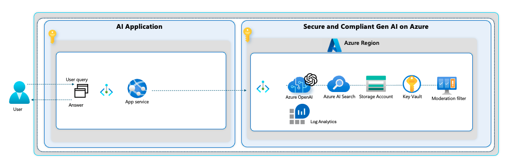
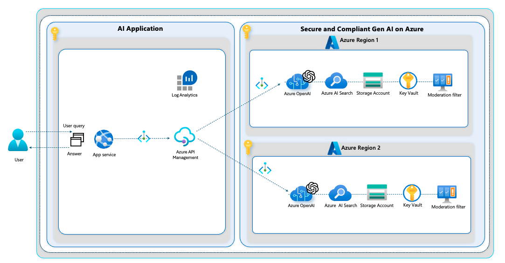

# Multi region deployment of Azure AI services

There are several reasons why one might want to set up Azure OpenAI in multiple regions:

* Improved Performance: Setting up Azure OpenAI in multiple regions can help in reducing latency. When your application is hosted in multiple regions, the data doesn't need to travel as far to reach your users, leading to faster response times.
* High Availability: Having Azure OpenAI in multiple regions can provide a higher level of availability. In case of a failure or outage in one region, traffic can be redirected to another region, ensuring uninterrupted service.
* Disaster Recovery: A multi-region approach can also provide a robust disaster recovery solution. In the event of a catastrophic event impacting a whole region, you still have other regions as a fallback.
* Compliance and Data Residency: In certain industries or countries, there are regulations that require data to be stored in a specific geographical location. Deploying Azure OpenAI in multiple regions can help in meeting these compliance requirements.
*Scalability: Finally, deploying in multiple regions can provide more scalability. As your user base grows globally, you can add more regions to handle the increased traffic and demand.

## Single region

Single instance of the required services.

## Multi region

### Using Azure API Management with your AI workload

Azure API Management provides several advantages when used in conjunction with Azure OpenAI:

* Centralized API Management: Azure API Management provides a unified, centralized platform to manage, secure, and mediate all your APIs, including those of Azure OpenAI. This makes it easier to control and monitor all your API interactions.
* Security: Azure API Management allows you to secure your APIs, including Azure OpenAI, using a range of authorization and authentication protocols, such as OAuth 2.0, OpenID Connect, and Azure Active Directory. This ensures that only authorized clients can access your APIs.
* Throttling and Quotas: Azure API Management allows you to set up rate limiting and quotas for your APIs. This helps prevent abuse and ensures that the API resources are fairly distributed among all users.
* Analytics and Insights: Azure API Management provides rich analytics and insights about the usage of your APIs. This can help you understand how your Azure OpenAI services are being used, identify trends, and make informed decisions.
* Developer Portal: Azure API Management provides a developer portal where you can publish your APIs, including Azure OpenAI. Developers can explore the APIs, understand how to use them, and even test them directly from the portal.
* Versioning and Revision: Azure API Management makes it easy to version your APIs and manage changes. This is particularly useful when you want to introduce new features or changes in your Azure OpenAI APIs without disrupting existing clients.
* Scaling and Performance: Azure API Management provides automatic scaling to handle varying loads, ensuring that your Azure OpenAI services perform optimally even under heavy traffic.
* Integration: Azure API Management seamlessly integrates with other Azure services, like Azure Monitor and Azure Logic Apps, providing greater flexibility and enabling more complex workflows.

### Multi region deployment

Deploying Azure OpenAI across multiple regions using Azure API Management involves several steps. This article will guide you through the entire process, ensuring you have a robust, scalable solution that can handle your AI needs regardless of location.

| Reference Implementation | Description | Deploy | Documentation
|:----------------------|:------------|--------|--------------|
| Secure and Compliant Generative AI on Azure | Secure and Compliant Generative AI, aligned with the prescriptive guidance for FSI Landing Zones, ensuring a secure and compliant Azure Open AI workload composition into the landing zones | | [User Guide](./fsiAOAI.md)

What happens during the deployment is:

1. Azure OpenAI:
Start by setting up Azure OpenAI in your primary region. Use the provided templates to create a new resource for OpenAI and associated AI services. When configuring the resource, specify the desired region. Do this again for all relevant regions.
2. Azure API Management:
In the same region where you've deployed your AI services, set up Azure API Management. This service allows you to manage APIs, handle retry logic and monitor their performance. In the Azure portal, create a new API Management service. Again, specify the region, subscription, resource group, and name.
3. OpenAI API Backend:
Once your API Management service is set up, the Azure OpenAI APIs for each region to backends are added.
4. API Policies:
After importing the API, the policies for rate limiting, quotas, and transformations gets configured. These policies help manage traffic and ensure fair usage. Azure provides a policy editor to facilitate this process.
5. In case you are using PTU's and are exceeding your capacity, the API will respond a 429 message. This message contains a header with the recommended wait time for your next retry.

### Using API Management for additional logging metrics

This architecture benefits from the logging capabilities of Azure API Management. But adding API Management brings its own complexity in managing all the changes behind the endpoints of Azure OpenAI.

| Metric        | Native Azure OpenAI logging   | Extensive Logging Architecture|
| ------------- |:-------------:| :---------------------:|
|Request count|x|x|
|Data in (size) / data out (size)|x|x|
|Latency    |x|x|
|Token transactions (total)|x|x|
|Caller IP address  |x (last octet masked)|x|
|Model utilization|  |x|
|Token utilization (input/output)||x|
|Input prompt detail||x|
|Output completion detail||x|
|Deployment operations|x|x|
|Embedding operations|x|x (limited to 8,192 response characters)|