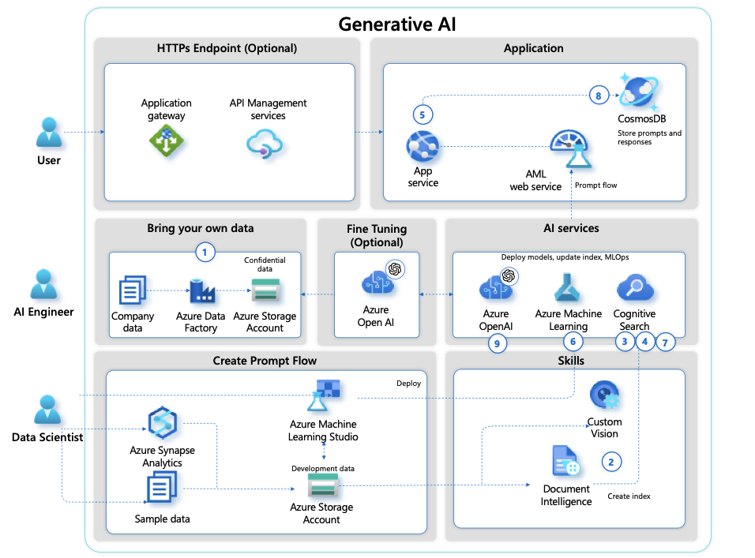

# GPT on your Enterprise data

etrieval-Augmented Generation (RAG) is a technique developed by Facebook AI, used to enhance the performance of language models in Natural Language Processing (NLP). It combines the advantages of pre-trained language models like BERT, GPT-2, or T5 with the ability to retrieve and use relevant external knowledge.

The RAG model operates in two main steps:
Retrieval: When a query or question is input, the model retrieves relevant documents or passages from an external document collection or knowledge base.
Generation: After retrieval, the RAG model uses a sequence-to-sequence architecture to generate an answer. The model takes as input the original query and the retrieved documents and generates a response. The generation process is not just a rephrasing or combination of the retrieved documents. Instead, the model uses the information from the documents to generate a new, contextually relevant response.

The key advantage of RAG is its ability to leverage external knowledge to generate answers, which allows it to provide more detailed and accurate responses compared to models that rely solely on pre-trained knowledge. It's particularly effective in question-answering tasks and can be used in a wide range of applications, including chatbots, customer service, and AI research.

In the context of Azure AI, while Azure OpenAI API does provide an out-of-the-box RAG solution, you can also leverage the suite of AI and machine learning tools to implement such a model. Azure's Machine Learning service provides the infrastructure and tools necessary for training, testing, and deploying machine learning models. You can also use Azure's Document Intelligence API for processing and analyzing text data, and Azure Web App Service for creating conversational AI applications.

## Azure AI Search

Azure AI Search and OpenAI can be paired to create a powerful search and AI solution. OpenAI provides advanced AI models, like GPT-4, which can generate human-like text. Azure AI Search provides sophisticated search capabilities. Here's how they could work together:
Data Ingestion and Indexing: Azure AI Search ingests data from various sources like Azure SQL Database, Azure Cosmos DB, Azure Blob Storage, and more. It then creates an index based on the data fields defined by the user, which makes the search operations faster and more efficient.
Enrichment with OpenAI: The ingested data can be sent to OpenAI's GPT-4 model for enrichment. For example, GPT-4 could generate summaries of long documents, answer questions about the content, or extract key points. This enriched data can then be indexed by Azure AI Search, enhancing the search capabilities further.
Querying with OpenAI: When a query is made, it could be processed by OpenAI's GPT-4 to understand the context better. For example, GPT-4 could convert a natural language query into a more structured form that Azure AI Search can understand.
Search and Retrieval: Azure AI Search retrieves the most relevant results based on the processed query. The results are ranked according to relevance, providing a rich search experience.
Post-processing with OpenAI: The search results can be further processed by OpenAI's GPT-4 for better presentation. For example, GPT-4 could generate a natural language summary of the search results.
Monitoring and Maintenance: The performance and usage of the search service can be tracked using Azure Monitor and Azure Log Analytics. The search indices, data sources, and other resources can be managed using the Azure portal, REST APIs, or .NET SDK.

1. Data Ingestion: Azure Cognitive Search supports numerous data connectors that allow you to ingest data from various sources. For instance, you can use Azure SQL Database, Azure Blob Storage, Azure Data Lake Store, or Azure Cosmos DB. It also supports connectors for popular SaaS platforms like SharePoint and Salesforce, and for on-premises or other cloud data sources through Azure Data Factory.
2. Skills in Azure Cognitive Search: The built-in skills in Azure Cognitive Search enable the extraction of key phrases, identification of language, people, organizations, locations, and more from unstructured text. You can also create custom skills to meet specific needs. These skills are part of the enrichment phase where raw input data is transformed and enriched before it gets indexed.
3. Index Creation: Creating an index in Azure Cognitive Search is fundamental for efficient search operations. The schema defines fields in your data, the data types of these fields, and how these fields should be treated in search operations. The data source points to the location of your data. The indexer crawls over the data source and automatically extracts searchable data and metadata based on the predefined schema.
4. Query Processing: Azure Cognitive Search supports full-text search queries, filters, facets, and even complex types. It uses a simple query syntax by default, but also supports the Lucene query syntax for more complex search queries.
5. Azure Function as Application Orchestrator: Azure Functions can be used to orchestrate the flow of data, for example, sending prompts to Azure OpenAI and handling the responses. Azure Functions are serverless and event-driven, meaning they scale automatically to handle incoming traffic.
6. Azure Machine Learning and Prompt Flow: Azure Machine Learning's Prompt Flow feature allows you to prototype, experiment, and iterate on your AI applications by linking LLMs, prompts, and Python tools in a visualized graph. It helps in debugging, sharing, and iterating your flows, creating prompt variants, and evaluating their performance.
7. Search Options in Azure Cognitive Search: Azure Cognitive Search provides a myriad of search options like full-text search across all fields in your data, filters to narrow down search results, facets for category navigation, autocomplete for query suggestions, and geospatial search for location-based results.
8. Storing Prompts: The input and output prompts can be stored in Azure Storage, a durable, scalable, and secure solution for data storage. These stored prompts can be used for improving the prompt flow and for analytics.
9. Interacting with Azure OpenAI: Azure OpenAI can be integrated into applications, products, or services. The API offers system message functionality, which can be used to provide real-time guidance or important information to the user during the conversation.
10. Content Management in Azure OpenAI: Azure OpenAI offers content management features that can be modified for specific use cases, especially when dealing with sensitive or confidential data. This requires meeting certain eligibility criteria and completing the modified access form.
