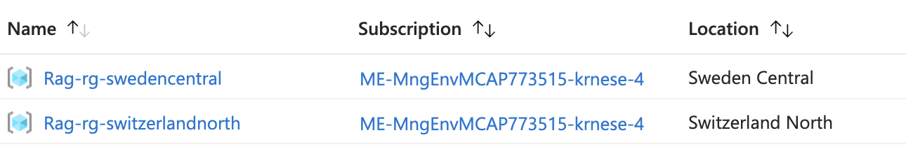
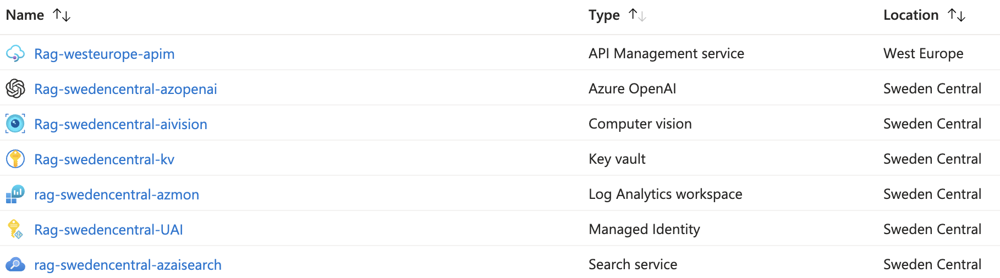
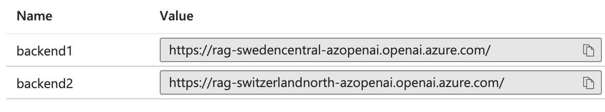
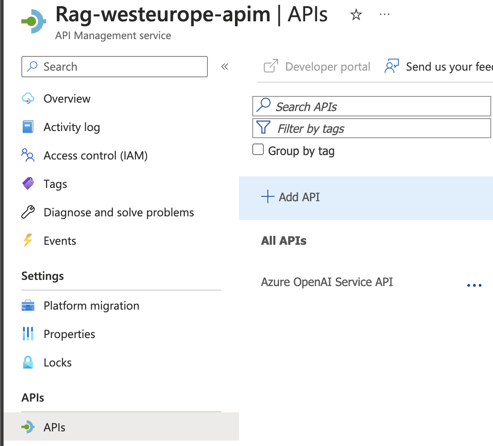
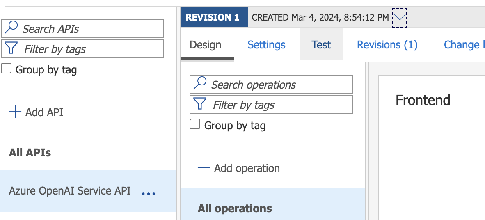
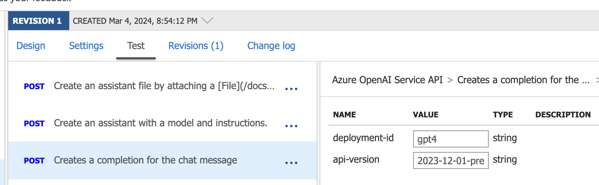
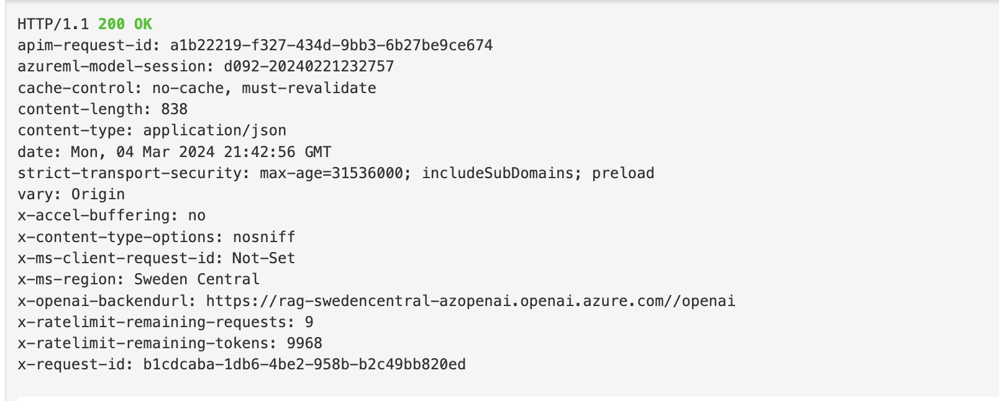
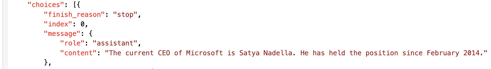

# Use Cases enabled by Enterprise Azure OpenAI Hub

This article provides instructions for how to leverage and validate the use cases you deployed as part of the Enterprise Azure OpenAI Hub. The table of content is aligned with the high-level deployment options provided in the reference implementation, so jump straight to the relevant section based on your deployment choice.

## Table of Contents

- [Production Deployment](#production-deployment)
    - ['On Your Data'](#azure-native-rag-on-your-own-data)
        - [PowerShell script for RAG enablement](#powershell-script-for-rag-enablement)
        - [Ingestion job using Azure Open AI, AI Search, and Storage Account](#ingestion-job-using-azure-open-ai-ai-search-and-storage-account)
        - [Content generation using Azure Open AI API endpoint](#content-generation-using-azure-open-ai-api-endpoint)
    - [Image and Video recognition](#image-and-video-recognition)
        - [PowerShell script for image and video recognition](#powershell-script-for-image-and-video-recognition)
        - [Image recognition using Azure Open AI API endpoint](#image-recognition-using-azure-open-ai-api-endpoint)
        - [Video recognition using Azure Open AI API endpoint](#video-recognition-using-azure-open-ai-api-endpoint)
- [Proof of Concept Deployment](#proof-of-concept-deployment)
    - ['On Your Data' with sample Web Application](#on-your-data-with-sample-web-application)
        - [Post deployment configuration for Web Application](#post-deployment-configuration-for-web-application)
        - [Validation steps](#validation-steps)
    - [Multi region deployment with APIM](#multi-region-deployment-with-apim)
        - [Validation steps](#validation-steps)

---

## Production Deployment

When selecting the production deployment option, you have the option to deploy the 'On Your Data' use case, and the Image and Video recognition use case into a single Azure region, with all security capabilities enabled by default, such as usage of Private Endpoint deploying into an existing Virtual Network that is already created with the required address space. This deployment option is recommended for - of course - production, to conform with the security and compliance requirements for highly regulated Enterprise customers.

The following sections provide instructions for how to leverage and validate these use cases.

## 'On Your Data'

When using Enterprise Azure OpenAI in a secure context, you may already have experienced that curated tools such as Azure OpenAI Studio will not be fully available, due to the following reasons:

1. Private Endpoints are being used for the Azure OpenAI service (and dependent services such as Azure AI Search and Azure Storage), and AI Studio cannot access the service over a private endpoint.
2. Storage account is deployed using Entra ID for centralized RBAC, and SAS tokens are disabled for the storage account, which is a recommended security best practice.
3. For both AI Search, and Azure OpenAI, local authentication is disabled, and similar to the storage account, RBAC is granted via Role Based Access Control (RBAC) and Entra ID. This means usage of API keys to access the services is not possible.
4. Restricted oubound traffic from the Azure services to the internet, and the Azure services are not accessible from the internet.

So, how do you get started with the 'On Your Data' use case, to first ingest your data so it can be chunked and indexed, while Azure OpenAI generate embeddings for you to chat with your own Enterprise data?

If we assume you will take care of the connectivity aspect, such as accessing the Azure OpenAI instance over the Private Endpoint since you are either 1) connecting from a client that can access the service via your virtual network, or 2) have deployed Azure Bastion (and a VM) into a dedicated subnet that can access the endpoint, you can use the following PowerShell script and instructions to get started with the 'On Your Data' use case, as we will simply validate the end to end flow before you start building more sophisiacted applications on top of the Azure OpenAI instance.

>Note: If you think the above assumptions aren't fair, and you think we should make it easier for you to also validate and get started even on a private endpoint using Azure Bastion from the get go - please let us know and create an [Issue](https://github.com/Azure/ai-hub/issues) so we can triage and prioritize accordingly. 

1. Upload files, such as text, images, and videos, to the storage account that you have created as part of the deployment, subject to the configuration you have selected (e.g., the setup highly recommends using Azure RBAC, disabling SAS tokens, and using customer-managed keys for encryption at rest, but if you have selected anything differently, you need to cater for that while getting the data into your storage account).

2. Use the Azure Open AI ingestion API to create one or more indexes in Azure AI Search, to start indexing the data that you have uploaded to the storage account, and make it available for the Azure Open AI instance to enable typical RAG use cases.

3. Use the Azure Open AI API to interact with the Azure Open AI instance, and start generating content based on the data that you have uploaded to the storage account, and indexed in Azure AI Search.

### PowerShell script for RAG enablement

The following PowerShell scripts can be used to 1) start an ingestion job on Azure Open AI to ingest the data from the storage account into Azure AI Search, and 2) access the Azure Open AI API to start generating content based on the data that you have ingested.

#### Ingestion job using Azure Open AI, AI Search, and Storage Account

Modify this script to provide the necessary values for the Azure Open AI endpoint, the embedding deployment name, the ingestion job name, the storage account endpoint, the storage container name, the storage resource ID, and the Azure AI Search endpoint.

```powershell

# Ingestion job using Azure Open AI, AI Search, and Storage Account. The following snippet assumes Managed Identity is properly configured and has the necessary permissions to access the resources, and that the user has Open AI contributor role on the Azure Open AI resource.

# Azure Open AI configuration

$AzureOpenAIEndpoint = ""
$EmbeddingDeploymentName = ""
$IngestionJobName = ""

# Storage Configuration

$StorageAccountEndpoint = ""
$StorageContainerName = ""
$StorageResourceId = ""

# Azure AI search configuraton

$AzureAiSearchEndpoint = ""

# Get Token

$TokenRequest = Get-AzAccessToken -ResourceUrl "https://cognitiveservices.azure.com"
$MyToken = $TokenRequest.token

# Set Body (body must be present but empty for the request)
$Body = @'  
{  
}  
'@  

# AI Ingestion Request
$AzureOAIRequest = @{
    Uri = "https://$($AzureOpenAIEndpoint)/openai/extensions/on-your-data/ingestion-jobs/$($IngestionJobName)?api-version=2023-10-01-preview"
    Headers = @{
        Authorization = "Bearer $($MyToken)"
        'Content-Type' = 'application/json'
        'storageEndpoint' = "https://$($StorageAccountEndpoint)"
        'storageConnectionString' = "ResourceId=$($StorageResourceId)"
        'storageContainer' = $StorageContainerName
        'searchServiceEndpoint' = "https://$($AzureAiSearchEndpoint)"
        'embeddingDeploymentName' = $EmbeddingDeploymentName
        }
    Body = $Body
    Method = 'PUT'
    }
    
$Response = Invoke-WebRequest @AzureOAIRequest
[Newtonsoft.Json.Linq.JObject]::Parse($Response.Content).ToString()

# Get Status on the ingestion job

$GetStatusRequest = @{
    Uri = "https://$($AzureOpenAIEndpoint)/openai/extensions/on-your-data/ingestion-jobs/$($IngestionJob)?api-version=2023-10-01-preview"
    Headers = @{
        Authorization = "Bearer $($MyToken)"
        }
    Method = 'GET'
}
$GetResponse = Invoke-WebRequest @GetStatusRequest
[Newtonsoft.Json.Linq.JObject]::Parse($GetResponse.Content).ToString()

```

#### Content generation using Azure Open AI API endpoint

Modify this script to provide the necessary values for the Azure Open AI endpoint, the embedding deployment name, and the model name.

```powershell

#T he following snippet assumes Managed Identity is properly configured and has the necessary permissions to access the resources, and that the user has Open AI reader role on the Azure Open AI resource.

# Azure Open AI configuration

$AzureOpenAIEndpoint = ""
$DeploymentName = ""
$EmbeddingDeploymentName = ""
$Prompt = ""

# Azure AI search configuraton

$AzureAiSearchEndpoint = ""
$IndexName = "" 

# Get Token
$TokenRequest = Get-AzAccessToken -ResourceUrl "https://cognitiveservices.azure.com"
$MyToken = $TokenRequest.token

# Form the request body towards the Azure Open AI API endpoint, with AzureCognitiveSearch added as dataSource for RAG
$Body = @"
{
"dataSources": [
    {
        "type": "AzureCognitiveSearch",
        "parameters": {
            "endpoint": "https://$($AzureAiSearchEndpoint)",
            "indexName": "$($IndexName)",
            "embeddingDeploymentName": "$($EmbeddingDeploymentName)"
        }
    }
],
"messages": [
    {
        "role": "system",
        "content": "You are an AI assistant that helps people find information."
    },
    {
        "role": "user",
        "content": "$($Prompt)"
    }
]
}
"@

# AI Request
$AzureOAIRequest = @{
    Uri = "https://$($AzureOpenAIEndpoint)/openai/deployments/$($DeploymentName)/extensions/chat/completions?api-version=2023-10-01-preview"
    Headers = @{
        Authorization = "Bearer $($MyToken)"
        'Content-Type' = 'application/json'
        }
    Method = 'POST'
    Body = $Body
    #UseBasicParsing = $true
    }
$Response = Invoke-WebRequest @AzureOAIRequest
[Newtonsoft.Json.Linq.JObject]::Parse($Response.Content).ToString()

```

## Multi region deployment with APIM

When selecting the "Proof of Concept" deployment intent, you have the option to deploy Enterprise Azure OpenAI Hub into multiple Azure regions where Azure API Management (APIM) is used to provide a single endpoint for the use cases, and the use cases are deployed into a single Azure region. This deployment option is recommended for proof of concept, to validate the power of API Mangement's policy logic to distribute traffic, provide retry logic, and to do error handling.

### Validation steps

When you have deployed Enterprise Azure OpenAI into multiple regions, you will see two Resource Groups in your Azure subscription, one Resource Group for the APIM instance together with the rest of the Azure services in the first region, and a second Resource Group in the second region. Assuming you have enabled RBAC and Managed Identity for the Azure services, you can follow the following steps to validate you can access the Azure OpenAI instances from APIM connected via Managed Identity.

In the following example, the deployments are made into "Sweden Central" and "Switzerland North" regions, and the APIM instance is deployed into the "West Europe" region.



And checking the "Rag-rg-swedencentral" Resource Group, you will see the following resources deployed, including APIM in the "West Europe" region.



1. Navigate to the APIM instance in the "West Europe" region, and select the "Named Values" section, and you will see the "backend1" and "backend2" named values. These are the Azure OpenAI instances deployed in the "Sweden Central" and "Switzerland North" regions, and you can use these named values to access the Azure OpenAI instances from APIM.



2. Access the APIM instance in the "West Europe" region, and navigate to the "APIs" section, and you will see the APIs that are deployed. You should see the "Azure OpenAi Service API".



3. Open the "Azure OpenAi Service API", and navigate to the "Test" section, and you can test the API to validate you can access the Azure OpenAI instances from APIM.



4. Select the "POSTS - Creates a completion for the chat message" API operation and provide the following input parameters to test the API:
- API-version: 2023-12-01-preview
- Deployment-id: The deployment *name* of the GPT4 you created during the deployment

>Note: If you did not deploy any GPT4 model, or did not select the 'On Your Data' use case, you will not have a deployment name to provide. To deploy a model to your Azure OpenAI instances, navigate to https://oai.azure.com and use the *same deployment name* for both instances, or APIM will not be able to access the Azure OpenAI model deployments in a consistent way.



5. Copy and paste the following JSON into the request body (you can obviously change the prompt to whatever you like):

```json
{
    "messages": [
        {
            "role": "system",
            "content": "You are an AI assistant that helps people find information."
        },
        {
            "role": "user",
            "content": "Who is the CEO of Microsoft?"
        }
    ]
}
```
Hit the "Send" button, and you should see a response from the Azure OpenAI instance in the "Sweden Central" region.



And finally, the response from the Azure OpenAI instance in the "Sweden Central" region.



You have now successfully validated that you can access the Azure OpenAI instances from APIM.


