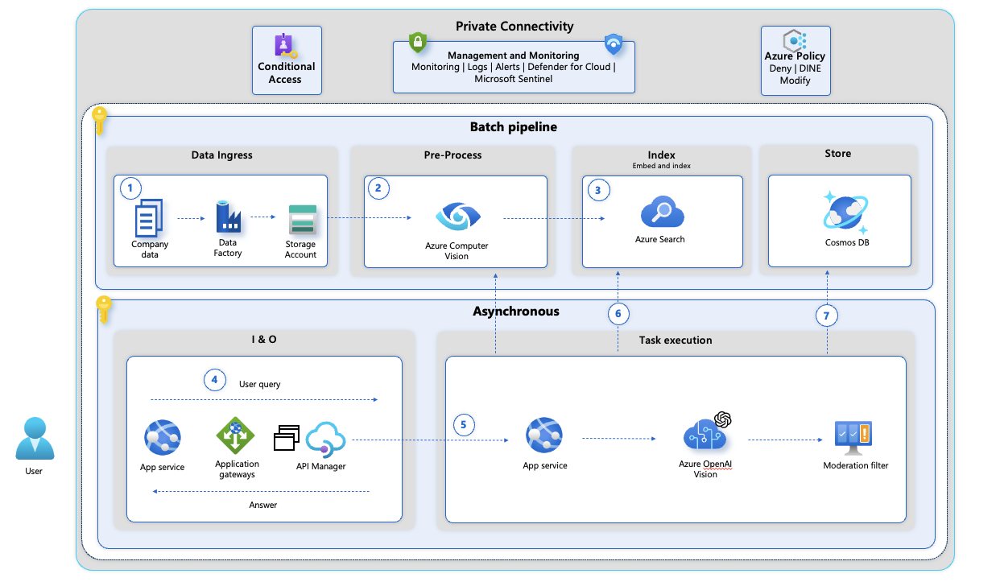

# Video Retrieval API

Using the Video Retrieval API together with Azure OpenAI Vision.

The Video Retrieval API from Azure AI services offers a range of functionalities to users. These include creating an index, retrieving an index, updating an index, deleting an index, listing all indexes, creating an ingestion, getting the ingestion status, listing all ingestions, retrieving all documents, and performing a text-based search.

Here's a brief overview of how to use this API:

* Authentication:
Before making a call to any API, include the header Ocp-Apim-Subscription-Key: YOUR_COMPUTER_VISION_KEY for authentication.
* CreateIndex:
This method creates an index, which is necessary before ingestion can be performed. You need to provide the name of the index, the requested API version, and the request body containing the metadata that could be used for searching.
* GetIndex:
This method retrieves the index with the specified name. It requires the name of the index and the requested API version.
* UpdateIndex:
This method updates an existing index. It requires the name of the index, the requested API version, and the request body containing the updates to be applied to the index.
* DeleteIndex:
This method deletes an index and all its associated ingestion documents. It requires the name of the index and the requested API version.
* ListIndexes:
This method retrieves a list of all indexes across all ingestions. It requires the requested API version and optionally, the number of datasets to be skipped and returned after skipping.
* CreateIngestion:
This method creates an ingestion for a specific index and ingestion name. It requires the names of the index and the ingestion, the requested API version, and the request body containing the ingestion request to be created.
* GetIngestion:
This method gets the ingestion status for the specified index and ingestion name. It requires the names of the index and the ingestion, the requested API version, and optionally, a level to indicate detail level per document ingestion status.
* ListIngestions:
This method retrieves all ingestions for a specific index. It requires the name of the index and the requested API version.
* ListDocuments:
This method retrieves all documents for a specific index. It requires the name of the index, the requested API version, and optionally, the number of datasets to be skipped and returned after skipping.
* SearchByText:
This method performs a text-based search on the specified index. It requires the name of the index, the requested API version, and the request body containing the query and other parameters.
