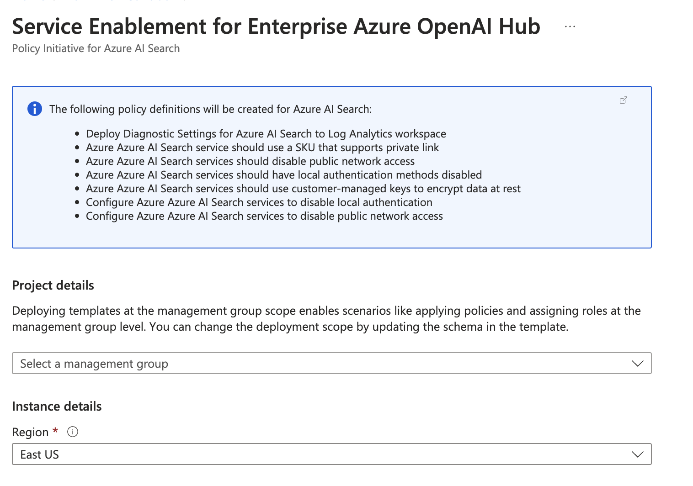

# Recommended Azure policies for the Enterprise Azure OpenAI Hub

If you are reading this, you may be on point for Azure service enablement within your organization, and you want to ensure that the Azure OpenAI service alongside with the requisite auxiliary services are deployed with the right configuration, and that the configuration is maintained over time.

Well, in that case, you are at the right place as we provide you with the recommended Azure policies and allows you to deploy them easily to your Management Groups in Azure, with the assumption you have a uniformed approach towards your subscription organizations :smile:

For detailed information on the recommended Azure policies, see the [Recommended Azure policies article](../docs/security.md#recommended-azure-policies-for-the-enterprise-azure-openai-hub)

| Azure Policy Initiatives | Description | Deploy  
|:----------|:-------------------------|:------------|  
| Secure and Compliant Azure OpenAI | Preventive and proactive policies to ensure Azure OpenAI conforms to Enterprise security requirements |  |   
| Secure and Compliant Azure Key Vault | Preventive and proactive policies to ensure Azure Key Vault conforms to Enterprise security requirements |  |
| Secure and Compliant Azure Storage | Preventive and proactive policies to ensure Azure Storage conforms to Enterprise security requirements |  |
| Secure and Compliant Azure Web App | Preventive and proactive policies to ensure Azure Web App conforms to Enterprise security requirements |  |
| Secure and Compliant API Management | Preventive and proactive policies to ensure API Management conforms to Enterprise security requirements |  |
| Secure and Compliant Azure Networking | Preventive and proactive policies to ensure Azure Networking conforms to Enterprise security requirements |  |
| Secure and Compliant Azure AI Search | Preventive and proactive policies to ensure Azure AI Search conforms to Enterprise security requirements |  |
<!--| Secure and Compliant Azure Data Factory | Preventive and proactive policies to ensure Azure Data Factory conforms to Enterprise security requirements |  |-->

When deploying one of the Azure Policy Initiatives above, you will be sent to the Azure Portal where you can select the target Management Group and then deploy the policy initiatives. Example below shows the service enablement via Azure Policy for Azure AI Search.

>Note: The deployment will not **assign** the policy initiative, but simply make it available in your Management Group to be assigned with one or more input parameters you must provide.

## Next Steps

Learn more about the overal [security and compliance recommendations](../docs/security.md) that are available for the **Enterprise Azure OpenAI Hub** reference implementation.